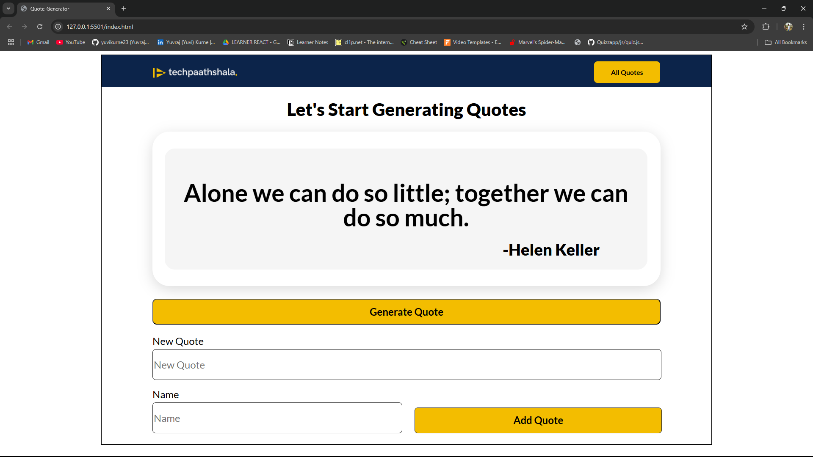

# ✨ Random Quote Generator

A simple and elegant **Random Quote Generator** built using **HTML, CSS, and JavaScript**. This web app fetches a new quote at the click of a button and offers users the ability to share it on Twitter — perfect for daily inspiration!

🔗 **Live Demo**: [Quote Generator](https://yuvikurne23.github.io/Quote-Generator/)

---

## 📌 Features

- 💬 Displays a random quote on button click
- 🔄 Fetches quotes from a free public API
- 🐦 Allows quote sharing directly on Twitter
- 📱 Fully responsive and mobile-friendly design

---

## 🛠️ Tech Stack

- **HTML5**
- **CSS3**
- **JavaScript (Vanilla)**

---

## 📷 Screenshot

 

---

## 🚀 How to Use

1. Clone the repository:
   ```bash
   git clone https://github.com/yuvikurne23/Quote-Generator.git
